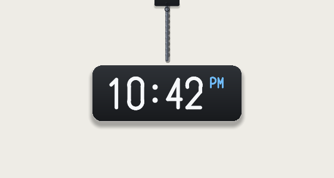
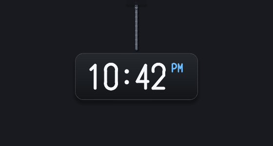

# Hanglock

**A working clock, hanging from the top of your screen.**

Not a widget. Not a webpage in a frameless window. A digital clock on the end of a rope, attached to
the top edge of your desktop: drag it, throw it, watch it swing and settle, and read the time while it
does. It is a productivity utility that happens to hang — clock now, timer and stopwatch next — and
it is designed to cost about nothing while you ignore it.

```
 screen top
 ─────────────────────────────────────
        │
        │  cord (real Verlet physics, 240 Hz)
        │
      ┌─┴──────────────┐
      │    10:42 PM    │   ← grab this to swing it
      └────────────────┘        Alt+drag anywhere, or drag the knot, to move where it hangs from
```

**Status: a usable Windows clock, not a demo of one.** It hangs, it swings, the tray is the control
surface, the mouse has three modes you can name, and the settings live in a window you can find with the
keyboard. Everything the repo can check without a desktop is checked in CI — three jobs, Linux and
Windows `x64` and `arm64`: fmt, clippy `-D warnings`, the suite (a golden trace against the reference
model, the placement and anchor maths, the settings round-trip, the recovery paths, the row form), both
generated artefacts against their generators, and on Windows the release link, a headless run of the built
executable and a 2 048 KB size gate. What CI cannot measure — a real tray, a real DPI change, idle CPU and
RAM, whether it *feels* right — is stated as owed in [docs/gate-a.md](docs/gate-a.md); the phase records are
[docs/reports/phase-1.md](docs/reports/phase-1.md) and
[docs/reports/phase-2.md](docs/reports/phase-2.md).

 

<sub>Rendered by the reference model in `tools/model/`, with the same constants and painter logic as
`hanglock-render` — design previews, not screenshots of the Windows build.</sub>

```sh
cargo build --release -p hanglock          # Windows: the overlay
cargo run -p hanglock -- --dump-scene a.png # any OS: the frame it would paint
cargo run -p hanglock -- --bench 400        # any OS: per-frame cost
cargo run -p hanglock -- --diag             # any OS: settings, placement, DPI, budgets
cargo test --workspace                      # any OS: the solver, placement, settings
```

## What it will be

* **Hanging, physically.** A fixed-timestep Verlet rope with a stretch ceiling and momentum that
  survives release. Not a looping animation, because the eye can tell.
* **Useful.** Clock → Timer → Stopwatch, on the same object, with no window to open.
* **Polite.** Click-through everywhere it isn't drawn, never steals focus, and it stops simulating
  when it settles: one small repaint per second, not a frame clock.
* **Native.** Windows 10/11 first, `x64` + `arm64`, per-monitor DPI, tray-resident, no installer bloat.

## The MVP, as built

One hanging digital clock, real rope physics, drag and throw, Always-on-Top, and persisted settings —
plus the four things that turned out to be what a daily utility needs:

* **Where it hangs is a setting, not an accident.** Alt+drag moves the hang point anywhere on the
  display; it is stored as a fraction of the width and a drop below the edge, so a scale change, a
  monitor switch and a restart all keep it. `Reset position` in the tray puts it back, and works even
  when the clock cannot be clicked.
* **Three mouse modes, named after what they do.** *Interactive (whole window)*, *Transparent areas
  click through* (the default), and *Fully click-through*. The third one is refused while the tray icon
  is not installed, because a clock that swallows nothing must still have a way to be told to stop.
* **The tray is the control surface, and the settings window draws the same list.** A row of that window
  and an item of that menu are the same `Command` on the same model, which is why they cannot show you
  two different apps. There is no Apply button, because every row is one already-valid click.
* **Nothing is written until you change something.** A first run leaves no file; a corrupt file comes
  back as defaults with one line on stderr and the original kept beside it.

Faces, themes, rope styles, timer, stopwatch and analog are specified for later phases and not built.
See [docs/mvp.md](docs/mvp.md).

## Stack

Rust, on the Win32 API directly: `WS_POPUP` + `WS_EX_LAYERED|TOPMOST|TOOLWINDOW|NOACTIVATE`, a
self-owned software compositor (`hanglock-render`: analytic signed-distance coverage for the cord, the
plate, the rim and the shadow, with the digits drawn from generated geometry rather than a font file)
presented with `UpdateLayeredWindow`, and per-pixel hit testing so transparent pixels pass clicks through
for free. No third-party crates, in the build or in the binary
([ADR-0002](docs/decisions/0002-zero-dependencies.md)). Target: **~0 % idle CPU,
~15 MB idle RAM, ≤ 4 MB installer.** Every alternative (Tauri, Electron, Flutter, WPF, Avalonia, Qt)
is scored against those numbers in
[docs/decisions/0001-technology-stack.md](docs/decisions/0001-technology-stack.md).

## Documentation

Start at [docs/index.md](docs/index.md) — architecture, MVP plan, roadmap, the stack decision, the
prior-art inspection it grew out of, and the boundaries that keep this project's own work its own.

| | |
|---|---|
| [docs/mvp.md](docs/mvp.md) | What ships first, in what order, with the gate each step must pass |
| [docs/architecture.md](docs/architecture.md) | Crates, data flow, window contract, physics, settings, budgets |
| [docs/roadmap.md](docs/roadmap.md) | Phases 0–7, and what is deliberately never |
| [docs/physics.md](docs/physics.md) | The solver: why it cannot stretch, why it settles, why a throw carries |
| [docs/gate-a.md](docs/gate-a.md) | Measured results and the numbers still owed on hardware |
| [docs/decisions/](docs/decisions/) | One file per real decision, with the alternatives that lost |
| [docs/research/](docs/research/) | Findings from the reference project, and what we won't copy |

## Principles

1. The physics and the model must not know what an `HWND` is. If they do, the boundary is wrong.
2. Nothing runs unless something changed. A clock's steady state is one repaint per second.
3. Legibility beats realism — and we say which trade-off we made, and why, in the docs.
4. Every performance claim ships with the command that measures it.
5. Original art, original code, own name. Ideas and published trade-offs are the import.

## Contributing

Open an issue before writing code for anything larger than a bug fix. Read
[docs/index.md](docs/index.md) → *Reading order* first; it takes ten minutes and prevents most
rejected PRs. Help wanted, specifically: Win32 overlay/DPI know-how, type design for a face that has
to survive grayscale antialiasing, and someone who enjoys writing physics tests.

## License

To be declared at the end of Phase 0. Proposed: MIT for code, OFL fonts bundled unmodified, our own
icon and wordmark released permissively so forks carry no legal ambiguity — with the rationale in an
ADR, since the reference project takes the opposite stance on its artwork
([docs/research/ip-boundaries.md](docs/research/ip-boundaries.md) §4).

Privacy: no network code, no telemetry, settings in one file under `%APPDATA%\Hanglock`. That is a
design constraint, not a marketing line — it will be verifiable from the binary's imports.
